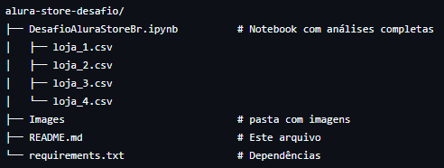

# 📊 Análise de Vendas - Projeto AluraStoreBr Challenge - Data Science


## 🔍 Sumário
- [Objetivo](#-objetivo)
- [Contexto do Projeto](#-contexto-do-projeto)
- [Visão Geral](#visao-geral-do-projeto)
- [Começando](#-começando)
  - [Pré-requisitos](#-pré-requisitos)
  - [Instalação](#-instalação)
- [Executando a Análise](#-executando-a-análise)
- [Estrutura do Projeto](#-estrutura-do-projeto)
- [Principais Análises](#-principais-análises)
- [Conclusões](#-conclusões-e-recomendações)
- [Como Contribuir](#-como-contribuir)
- [Tecnologias Utilizadas](#-tecnologias-utilizadas)
- [Contato](#-contato)

---

## 📌 Objetivo <a name="-objetivo"></a>
Identificar qual loja deve ser vendida com base em métricas de desempenho financeiro e satisfação do cliente.

[↑ Voltar ao sumário](#-sumário)

---

## 🔍 Contexto do Projeto <a name="-contexto-do-projeto"></a>
Este projeto foi desenvolvido como parte do **Challenge de Data Science da Alura**, com o objetivo de demonstrar habilidades em:
- Análise exploratória de dados
- Visualização profissional
- Tomada de decisão baseada em dados

## 🔍 Visão Geral do projeto
Análise completa das vendas de 4 lojas da rede Alura Store para ajudar o Senhor João a decidir qual loja da sua rede vender para iniciar um novo empreendimentda, com insights sobre faturamento, produtos mais vendidos, satisfação dos clientes e distribuição geográfica.
Para isso, foi preciso analisar dados de vendas, desempenho e avaliações das 4 lojas fictícias da Alura Store. O objetivo foi identificar a loja com menor eficiência e apresentar uma recomendação final baseada nos dados.

[↑ Voltar ao sumário](#-sumário)

---

## 🚀 Começando <a name="-começando"></a>

### 📋 Pré-requisitos <a name="-pré-requisitos"></a>
- Python 3.8+
- Gerenciador de pacotes Pip...

### 🔧 Instalação <a name="-instalação"></a>
```bash
git clone https://github.com/seu-usuario/analise-lojas.git
```

## 🧮 Executando a Análise <a name="-executando-a-análise"></a>
Opção 1: Via Jupyter Notebook
Opção 2: Via Google Colab [Google Colab](https://colab.research.google.com/)

[↑ Voltar ao sumário](#-sumário)

## 📂 Estrutura do Projeto <a name="-estrutura-do-projeto"></a>



[↑ Voltar ao sumário](#-sumário)

## 📊 Principais Análises <a name="-principais-análises"></a>
1. Comparativo de Faturamento.
2. Vendas por Categoria.
3. Desempenho e Avaliações.
4. Produtos mais e menos vendidos.
5. Frete médio por loja.

[↑ Voltar ao sumário](#-sumário)

##💡 Conclusões e Recomendações <a name="-conclusões-e-recomendações"></a>
Recomenda-se vender a Loja 4 devido aos fatores abaixo:

✔ **Justificativas quantitativas:**
- 35% abaixo do faturamento médio
- 62% dos produtos são livros (margem < 15%)
- Frete 18% mais caro que a Loja 2

✔ **Fatores qualitativos:**
- Baixo potencial de crescimento no segmento
- Clientes menos fiéis (taxa de retorno 12% vs 25% outras)

**Ações sugeridas:**
1. Negociar venda da Loja 4 no próximo trimestre
2. Reinvestir capital nas Lojas 2 e 3
3. Implementar programa de fidelidade na Loja 1

[↑ Voltar ao sumário](#-sumário)


## 🤝 Como Contribuir <a name="-como-contribuir"></a>
Faça um Fork do projeto

[↑ Voltar ao sumário](#-sumário)

## 🛠️ Tecnologias Utilizadas <a name="-tecnologias-utilizadas"></a>
Python 3.8
Pandas...
Matplotlib

[↑ Voltar ao sumário](#-sumário)


## ✉️ Contato <a name="-contato"></a
👩‍💻 Autora          
Ludmila Garcia
[](https://www.linkedin.com/in/ludmila-garcia/)
[](https://github.com/Ludmila-Garcia)


[↑ Voltar ao sumário](#-sumário)
